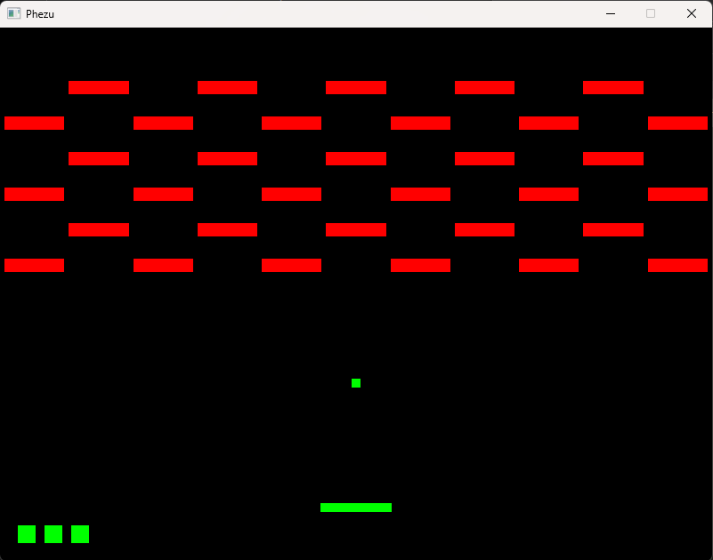

# Breakout
Standalone builds available in the releases section.

# Building for Mac
Requirements:
	None
Instructions:
	Download and open terminal at the root directory
	run the command ./Setup_Mac.sh

# Building for Windows
Requirements:
	Visual Studio Installation	
Instructions:
	Download and double click Setup_Win.bat

# Description
This repository contains a Game Engine library and a sample Breakout clone that uses it.

